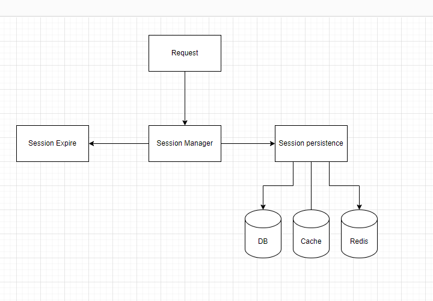

- Service Session Manager
    - Keepalive: tính năng giữ phiên
    - Khởi tạo phiên với số lượng cấu hình
- Quản lý sesison hết hạn
    - Lập lịch theo thời gian cấu hình truy xuất các session expire thực hiện giải phóng.
- Session persistence:
    - Quản lý lưu trữ các session theo nghiệp vụ hỗ trợ theo redis,cache,database

###### ########################################################################################

- Triển khai module AuthenUser: sessionId,status (USE,UNUSE,EXPIRE --> 0,1,2),timeCreate,timeExpire
- Abstract Session Management
 - Init session USE
